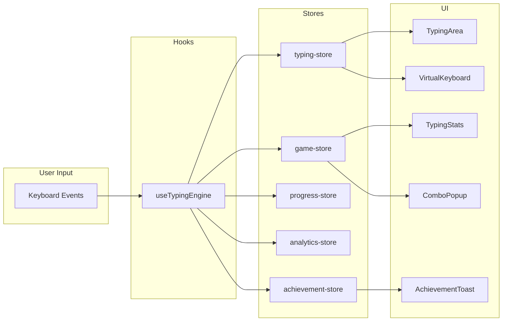

<div align="center">

# ⌨️ TypeMaster Pro

### An AI-Powered Adaptive Typing Learning Platform

[](https://nextjs.org/)
[](https://www.typescriptlang.org/)
[](https://tailwindcss.com/)
[](https://zustand-demo.pmnd.rs/)
[](LICENSE)

*Master touch typing with adaptive lessons, gamification, and real-time analytics*

**📖 Estimated Reading Time: 12 minutes** | **Last Updated: February 2026**

---

[Features](#-features) • [Quick Start](#-quick-start) • [Architecture](#-architecture) • [Usage](#-usage) • [Roadmap](#-roadmap)

</div>

---

## 📸 Screenshots

> *Application screenshots coming soon*

---

## ✨ Features

### 🎯 Core Typing Engine
- **Real-time keystroke tracking** with accuracy and WPM calculation
- **Progressive lessons** from home row to full keyboard + numbers + symbols
- **Multiple practice modes**: Lesson, Free Practice, Speed Test, Custom Text
- **Visual keyboard** with finger position hints and active key highlighting

### 🎮 Gamification System
- **28 Achievements** across 6 categories (Quick Wins, Speed, Accuracy, Milestones, Streaks, Secret)
- **Combo system** with multipliers and visual popups
- **Daily challenges** with seeded random generation (same for all users daily)
- **Points and scoring** system with leaderboard potential
- **Confetti celebrations** for milestones and achievements

### 📊 Analytics & Progress
- **Per-key weakness detection** to identify problem keys
- **Performance history** with WPM/accuracy trends
- **Personal bests** tracking (WPM, accuracy, combos)
- **Practice time** and keystroke counting
- **Daily streak** tracking

### 🏃 Speed Training
- **Metronome Mode**: Build consistent rhythm with configurable BPM (30-120)
- **Sprint Mode**: Interval training with customizable sprint/rest durations

### 🔊 Sound Effects
- **Tone.js integration** for synthesized audio feedback
- **Keystroke sounds** with random pitch variation
- **Error sounds**, combo chimes, and completion fanfares
- **Fully customizable** volume and category toggles

---

## 🚀 Quick Start

### Prerequisites

- Node.js 18+ 
- npm, yarn, or pnpm

### Installation

```bash
# Clone the repository
git clone https://github.com/yourusername/typemaster-pro.git
cd typemaster-pro

# Install dependencies
npm install

# Start development server
npm run dev
```

Open [http://localhost:3000](http://localhost:3000) in your browser.

### Build for Production

```bash
npm run build
npm start
```

---

## 🏗️ Architecture

### Tech Stack

| Category | Technology | Purpose |
|----------|------------|---------|
| **Framework** | Next.js 16 (App Router) | React framework with SSR |
| **Language** | TypeScript 5 | Type safety |
| **Styling** | Tailwind CSS 4 | Utility-first CSS |
| **State** | Zustand 5 | Lightweight state management |
| **Animation** | Framer Motion | Declarative animations |
| **Charts** | Recharts | Data visualization |
| **Audio** | Tone.js | Web audio synthesis |
| **Effects** | canvas-confetti | Celebration particles |
| **UI** | Radix UI | Accessible primitives |
| **Icons** | Lucide React | Modern icon library |
| **Notifications** | react-hot-toast | Toast notifications |

### Project Structure

```
src/
├── app/                    # Next.js App Router pages
│   ├── achievements/       # Achievement gallery
│   ├── challenges/         # Daily challenges
│   ├── lessons/[id]/       # Dynamic lesson pages
│   └── practice/           # Practice modes
│       └── speed-training/ # Metronome & Sprint modes
├── components/
│   ├── gamification/       # Combo popup, achievement toast
│   ├── keyboard/           # Virtual keyboard
│   ├── settings/           # Sound settings
│   ├── typing/             # Typing area, stats display
│   └── ui/                 # Reusable UI components
├── hooks/
│   ├── use-confetti.ts     # Confetti effects
│   ├── use-sound.ts        # Sound playback
│   └── use-typing-engine.ts # Core typing logic
├── lib/
│   ├── achievements.ts     # 28 achievement definitions
│   ├── daily-challenges.ts # Seeded challenge generator
│   ├── keyboard-data.ts    # QWERTY layout data
│   ├── lessons.ts          # 11 progressive lessons
│   ├── practice-texts.ts   # Random practice content
│   └── sound-engine.ts     # Tone.js synthesizers
├── stores/
│   ├── achievement-store.ts # Unlocked achievements
│   ├── analytics-store.ts   # Per-key weakness tracking
│   ├── game-store.ts        # Combos, score, streaks
│   ├── progress-store.ts    # Completed lessons, records
│   └── typing-store.ts      # Current session state
└── types/
    └── index.ts             # Shared TypeScript types
```

### Data Flow



---

## 📖 Usage Guide

### For End Users

#### Starting a Lesson

1. Navigate to the **homepage**
2. Select a lesson category (Home Row, Top Row, Bottom Row, etc.)
3. Click on a lesson to begin
4. Type the displayed text - errors are highlighted in real-time
5. Complete the lesson to see your results and unlock achievements

#### Practice Modes

| Mode | Description | Access |
|------|-------------|--------|
| **Lesson** | Structured curriculum | Homepage → Select Lesson |
| **Free Practice** | Random paragraphs, no time limit | Practice → Free Mode |
| **Speed Test** | 1, 2, or 5-minute timed tests | Practice → Speed Test |
| **Custom** | Paste your own text | Practice → Custom |
| **Metronome** | Rhythm-based training | Practice → Speed Training |
| **Sprint** | Interval training | Practice → Speed Training |

#### Understanding Statistics

- **WPM**: Words per minute (1 word = 5 characters)
- **Accuracy**: Percentage of correct keystrokes
- **Combo**: Consecutive correct keystrokes
- **Multiplier**: Score multiplier based on combo level

#### Tips for Best Results

1. **Start with home row** - Master the foundation before moving on
2. **Don't look at the keyboard** - Use the virtual keyboard as a reference
3. **Prioritize accuracy over speed** - Speed will come naturally
4. **Practice daily** - Even 10 minutes helps build muscle memory
5. **Use the metronome** - Builds consistent rhythm at your target speed

### For Developers

#### Adding New Lessons

Edit `src/lib/lessons.ts`:

```typescript
{
  id: 'my-lesson-1',
  title: 'My Custom Lesson',
  description: 'Learn specific key combinations',
  category: 'custom', // Add new category if needed
  keys: ['a', 'b', 'c'],
  targetWpm: 25,
  targetAccuracy: 90,
  exercises: [
    { id: 'ml-1', text: 'abc cba abc cba', difficulty: 'beginner' },
    { id: 'ml-2', text: 'cab bac abc cba', difficulty: 'intermediate' },
  ],
}
```

#### Adding New Achievements

Edit `src/lib/achievements.ts`:

```typescript
// Add to achievements array
{
  id: 'my-achievement',
  title: 'My Achievement',
  description: 'Unlock condition description',
  icon: '🎯',
  category: 'milestone',
  points: 50,
}

// Add corresponding condition
{
  achievementId: 'my-achievement',
  check: (progress, game) => progress.someCondition >= threshold,
}
```

#### Creating Practice Modes

1. Create page in `src/app/practice/my-mode/page.tsx`
2. Use `useTypingEngine` hook for core functionality
3. Add mode to `PracticeMode` type in `src/types/index.ts`

---

## 🎯 Implementation Status

| Feature Category | Total | ✅ Complete | 🚧 Partial | ⏳ Planned |
|-----------------|-------|-------------|------------|------------|
| Core Engine | 8 | 8 | 0 | 0 |
| Lessons | 11 | 11 | 0 | 0 |
| Practice Modes | 6 | 6 | 0 | 0 |
| Analytics | 5 | 4 | 1 | 0 |
| Gamification | 6 | 6 | 0 | 0 |
| Achievements | 28 | 28 | 0 | 0 |
| Sound Effects | 7 | 7 | 0 | 0 |
| Speed Training | 2 | 2 | 0 | 0 |
| AI Features | 4 | 0 | 0 | 4 |

**Overall Completion: ~90%** (Core features complete, AI features planned)

---

## 📊 Code Statistics

| Metric | Value |
|--------|-------|
| **Total Lines of Code** | ~5,000 |
| **TypeScript/TSX Files** | 35+ |
| **React Components** | 15 |
| **Custom Hooks** | 3 |
| **Zustand Stores** | 5 |
| **Lessons** | 11 |
| **Total Exercises** | 35+ |
| **Achievements** | 28 |
| **Daily Challenges** | 3/day |
| **Sound Types** | 7 |

---

## 🎨 Design System

### Color Palette

| Name | Usage |
|------|-------|
| `background` | Page backgrounds |
| `foreground` | Primary text |
| `primary` | Interactive elements, accents |
| `muted` | Secondary backgrounds |
| `destructive` | Errors, mistakes |
| `yellow-500` | Achievements, rewards |
| `orange-500` | Streaks, fire effects |
| `green-500` | Success, correct input |

### Typography

- **Sans-serif**: Inter (UI text)
- **Monospace**: JetBrains Mono (typing text)

### Animation Principles

1. **Subtle entrances**: `opacity: 0 → 1`, `y: 20 → 0`
2. **Spring physics**: Natural, bouncy interactions
3. **Micro-animations**: Key presses, combo popups
4. **Celebrations**: Confetti on milestones

---

## 🐛 Known Issues & Limitations

- **Browser Compatibility**: Tested primarily on Chrome/Firefox
- **Mobile**: Limited touch typing experience (desktop recommended)
- **Sound**: Requires user interaction to initialize Web Audio API
- **Persistence**: Uses localStorage (no cloud sync yet)

---

## 🗺️ Roadmap

### ✅ Completed (Phase 1 & 2)

- [x] Core typing engine with WPM/accuracy
- [x] Progressive lesson system (11 lessons)
- [x] Virtual keyboard with finger hints
- [x] Practice modes (Free, Speed Test, Custom)
- [x] Gamification (combos, scores, multipliers)
- [x] 28 achievements with toast notifications
- [x] Daily challenges with seeded generation
- [x] Speed training (Metronome + Sprint)
- [x] Sound effects with Tone.js
- [x] Per-key weakness detection

### ⏳ Planned (Phase 3)

- [ ] **AI-Powered Lessons**: Personalized exercises based on weaknesses
- [ ] **Bigram/Trigram Analysis**: Identify problem letter combinations
- [ ] **Cloud Sync**: Save progress across devices
- [ ] **Leaderboards**: Global and friends-based rankings
- [ ] **Custom Themes**: Dark/light mode, color customization
- [ ] **Import Lessons**: Upload custom lesson content
- [ ] **Typing Games**: Word races, survival mode

---

## 🤝 Contributing

Contributions are welcome! Please follow these steps:

1. Fork the repository
2. Create a feature branch (`git checkout -b feature/amazing-feature`)
3. Commit your changes (`git commit -m 'Add amazing feature'`)
4. Push to the branch (`git push origin feature/amazing-feature`)
5. Open a Pull Request

### Code Style

- Use TypeScript strict mode
- Follow ESLint configuration
- Use Prettier for formatting
- Write meaningful commit messages

---

## 📄 License

This project is licensed under the MIT License - see the [LICENSE](LICENSE) file for details.

---

## 🙏 Acknowledgments

### Libraries & Tools

- [Next.js](https://nextjs.org/) - React framework
- [Tailwind CSS](https://tailwindcss.com/) - Styling
- [Zustand](https://zustand-demo.pmnd.rs/) - State management
- [Framer Motion](https://www.framer.com/motion/) - Animations
- [Tone.js](https://tonejs.github.io/) - Web audio
- [Radix UI](https://www.radix-ui.com/) - UI primitives
- [Lucide](https://lucide.dev/) - Icons
- [canvas-confetti](https://github.com/catdad/canvas-confetti) - Celebrations

### Inspiration

- [TypingClub](https://www.typingclub.com/)
- [Keybr](https://www.keybr.com/)
- [MonkeyType](https://monkeytype.com/)

---

## 📞 Support

- **Issues**: [GitHub Issues](https://github.com/yourusername/typemaster-pro/issues)
- **Discussions**: [GitHub Discussions](https://github.com/yourusername/typemaster-pro/discussions)

---

<div align="center">

**Made with ⌨️ and ❤️**

*Happy Typing!* 🚀

</div>

